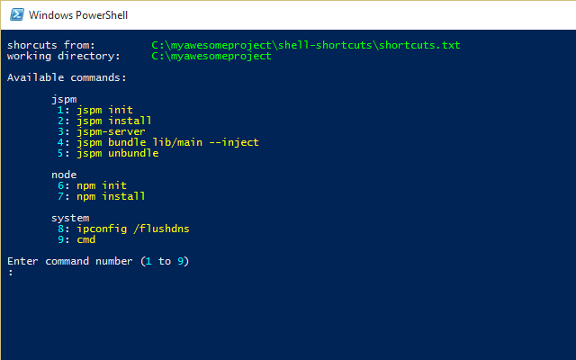

# shell-shortcuts
Create a custom menu of predefined shell commands.



When developing on Windows, you find that many times a day you have click the start button and find ```cmd.exe```, then navigate to the folder you are working on (using a few ```cd``` commands), then type out a command such as ```npm init```.
This script is designed to save time when developing with software that requires frequent command line interaction, such as ```node```, ```bower```, ```jspm```, ```sass```, ```grunt```, ```gulp```, ```ghost```, etc.

```shortcuts.bat``` reads the lines out of ```shortcuts.txt``` where each line represents a command that is to be run.
A menu is then created and displayed in a ```powershell``` window (as shown above), with each command labelled with a menu number.
You simply select a number and the listed command is spawned in a new ```cmd``` window.
The ```powershell``` menu remains open while the command executes (as it is in a separate window), and it is ready immediately (possible to issue multiple commands simultaneously / synchronously).

Simple to use and highly customisable.

Single script with single config file - just add 2 files and it's ready to use.

Serves as a reminder for those hard-to-remember commands.


## Install
Download the latest ```shortcuts.bat``` from https://github.com/norgeous/shell-shortcuts/releases/latest and add it into your project folder root (or where you want the menu commands to be run from). You can rename it to something else, if you like.

## Configure
Create ```shortcuts.txt``` in the same folder as ```shortcuts.bat``` and write each command that you want listed in the menu on its own line.

Below is an example ```shortcuts.txt```
```
#jspm
jspm init
jspm install
jspm-server
jspm bundle lib/main --inject
jspm unbundle

#node
npm init
npm install

#system
ipconfig /flushdns
cmd
```
Section titles can be added by putting a ```#``` at the start of a line.

All blank lines are ignored.


## Usage
Just double click ```shortcuts.bat``` to load ```shortcuts.txt``` (by default) then select a command by typing its number.
The commands are run in the same folder as ```shortcuts.txt```.

You can use multiple files for configuring different custom menus, just drag any file (containing a configuration as shown above) onto ```shortcuts.bat```.


## Advanced Usage

### Change the working directory
By default the menu commands are run from the folder that ```shortcuts.txt``` is in.
If you don't want any of these files to be included in your project folder and you can define a different folder by including ```##wd=``` in your ```shortcuts.txt``` to change the working directory for all commands.
```
##wd=c:\some\dir\path
```


### Post execution behaviour
By default, the spawned ```cmd``` window will ```PAUSE``` after execution finishes. If you would like to adjust this behaviour add ```##after=``` to ```shortcuts.txt```
To add a timeout instead, use:
```
##after=TIMEOUT 30
```
To keep the window open and allow further commands to be entered manually, use:
```
##after=CMD
```
For automatic exit, use:
```
##after=EXIT
```


### Chaining menu commands
You can chain together multiple commands to run as one menu entry in ```shortcuts.txt```, as you would in batch - with the ```&``` symbol.
```
jspm init & ECHO hello & PAUSE
```


### Application mode
If you like using ```shortcuts.bat``` and find yourself doing so regularly, you can do the following trick.
Rename the extension of your ```shortcuts.txt``` config file(s) to something else that you know is unused on your system, for example ```.ssc```.
Then you can associate that file extension with ```shortcuts.bat``` using the ```Open With...``` dialogue.
Now you can double click an ```.ssc``` file to open the custom menu.


### Hidden Commands
* Type ```r``` to reload the ```shortcuts.txt``` configuration.
* Type ```e``` to exit the script.