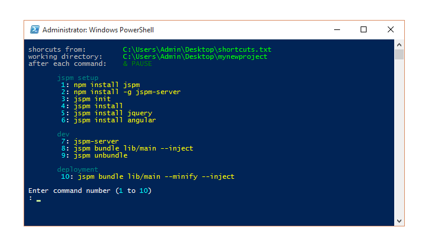

# shell-shortcuts
Run many predefined shell commands from a single launcher.

## Why
When developing on Windows, you find that many times a day you have click the start button and find ```cmd.exe```, then navigate to the folder you are working on (using a few ```cd``` commands), then type out a command such as ```npm init```.
This script is designed to save time (all of the steps above) when developing with software that requires command line interaction (such as ```node```, ```bower```, ```jspm```, ```sass```, ```grunt```, etc). 

## How
The script is run with a double click, it reads the lines of ```shortcuts.txt``` where each line represents a command that is to be run.
A menu is then created and displayed in a ```powershell``` window, each command has its own number. You can then simply select the command by its menu number and it is run in a new cmd.exe window.

## Install
Download the zip file https://github.com/norgeous/shell-shortcuts/archive/master.zip and extract ```shortcuts.bat``` and ```shortcuts.txt```into the root of your project folder.

## Configure
Open ```shortcuts.txt``` in a text editor to add or remove commands. Each command is on its own line.
Sections can be denoted with ```#``` for display purposes. Example:
```
#jspm
jspm init
jspm install
jspm-server
jspm bundle lib/main --inject
jspm unbundle

#node
npm init
npm install

#system
ipconfig /flushdns
cmd
```
Will create this menu:


## Usage
Double click the file ```shortcuts.bat``` and type a number shown in the menu.
Alternately, you can use multiple ```.txt``` files, just drag them onto the ```.bat``` file.
